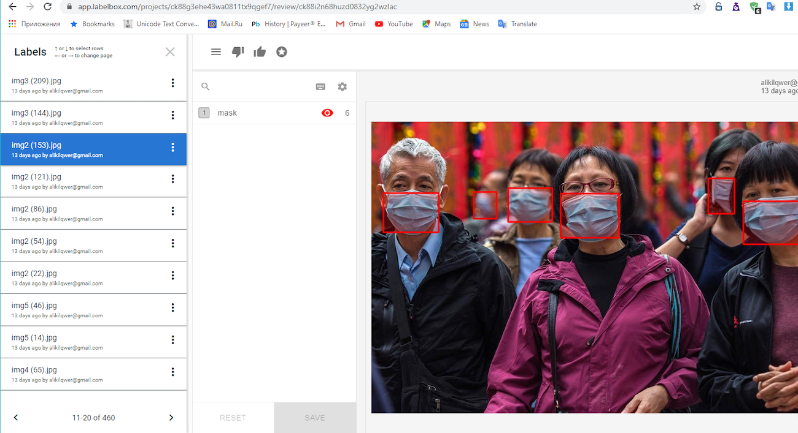
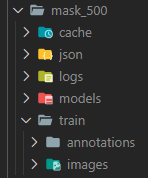

<p align="center">
  <a href="https://fulcrum.rocks/" target="blank"></a>
</p>
  <H1 align="center"><a href="https://blog.fulcrum.rocks/neural-network-image-recognition" target="blank">How to Create Neural Network for Recognizing Masks</a></br>[Part1] - Labeling</H1>

## Description

<p>Create annotation boxes to pictures.
Generate anchors for image recognition</p>

## Parts

<a href="https://github.com/fulcrum-rocks/image-recognition-labeling" target="blank">[Part1] - Labeling</a>

<a href="https://github.com/fulcrum-rocks/image-recognition" target="blank">[Part2] - Training & recognition</a>



## Supports

1. <H3><a href="https://labelbox.com/" target="blank">Labelbox</a></H3>
2. <H3><a href="https://supervise.ly/" target="blank">Supervise</a></H3>

## Tech stack:

1. NodeJS
2. OpenCV4NodeJS
3. Elementtree
4. Keras-js

## Installation

```bash
npm install
```

Env example:

```bash
DIRECTORY=mask_500
LABELS=mask
```

## Running the app

1. Write to env file
2. Put pictures /train/images
3. Label this pictures using labelbox
4. Put ready json file to folder /train/annotations
5. `npm run start`

## Results

Labesl ready for trainig using Yolov3.

Copy dataset folder to second project for training

Use Anchors from console or from json/detection_config as anchor for second project.

## Dataset Structure:

<p>src/</br></p>
